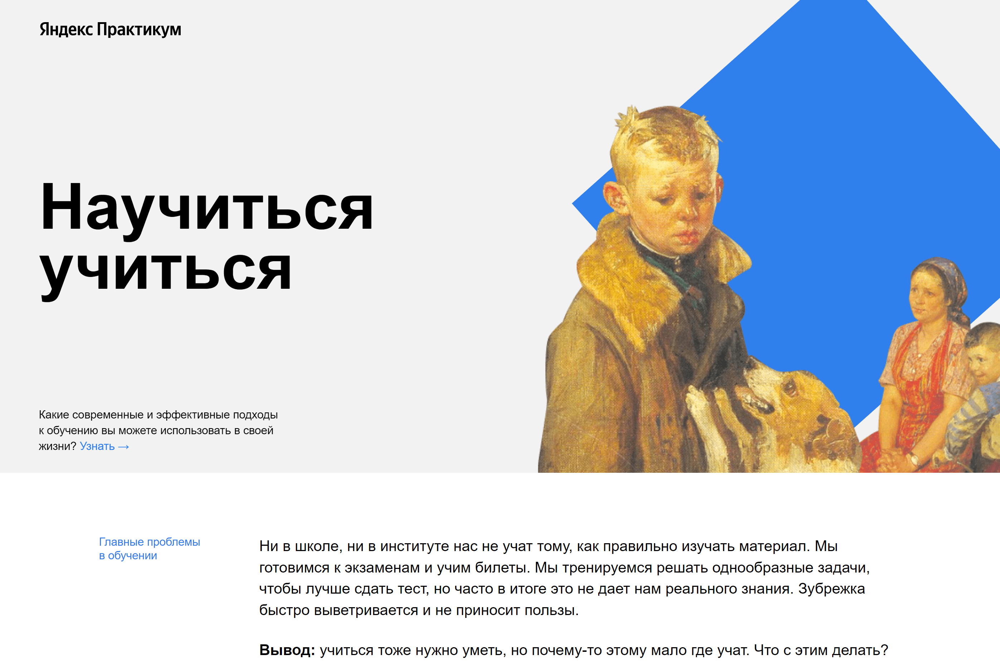

# Научиться учиться

## Описание:

Проектная работа.

Одностраничный лендинг.

* [Работа на GitHub Pages](https://apostaldante.github.io/how-to-learn/)

* Для позициониррования элементов исполльзовал flex или абсолютное позиционирование и z-index.
* Для анимации ссылок использовал opacity и transition.
* Для врашения фигур (квадрат, треугольник) использовал keyframes.
* Для вставки видео использовал iframe

**Desktop**

